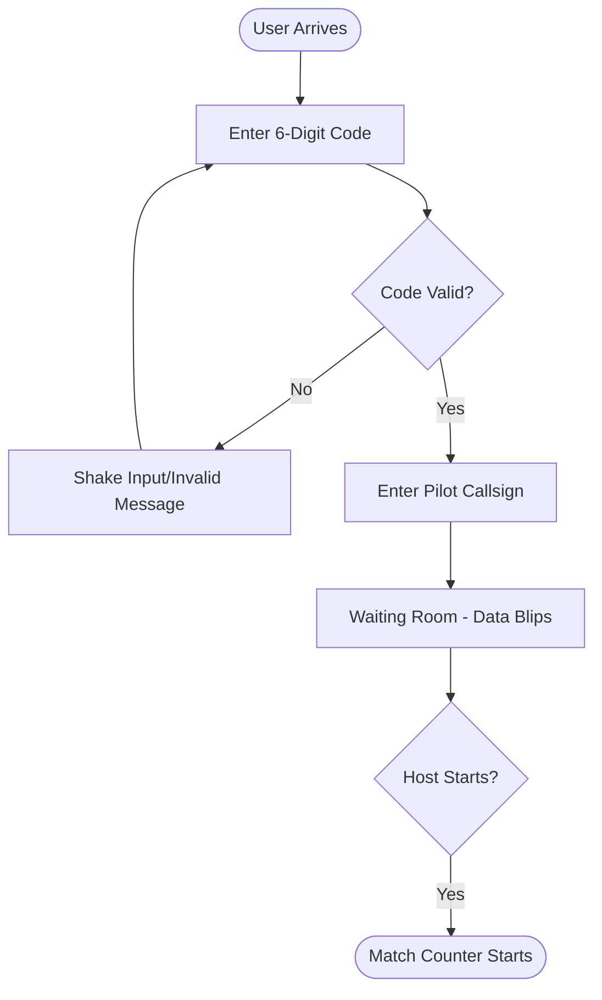
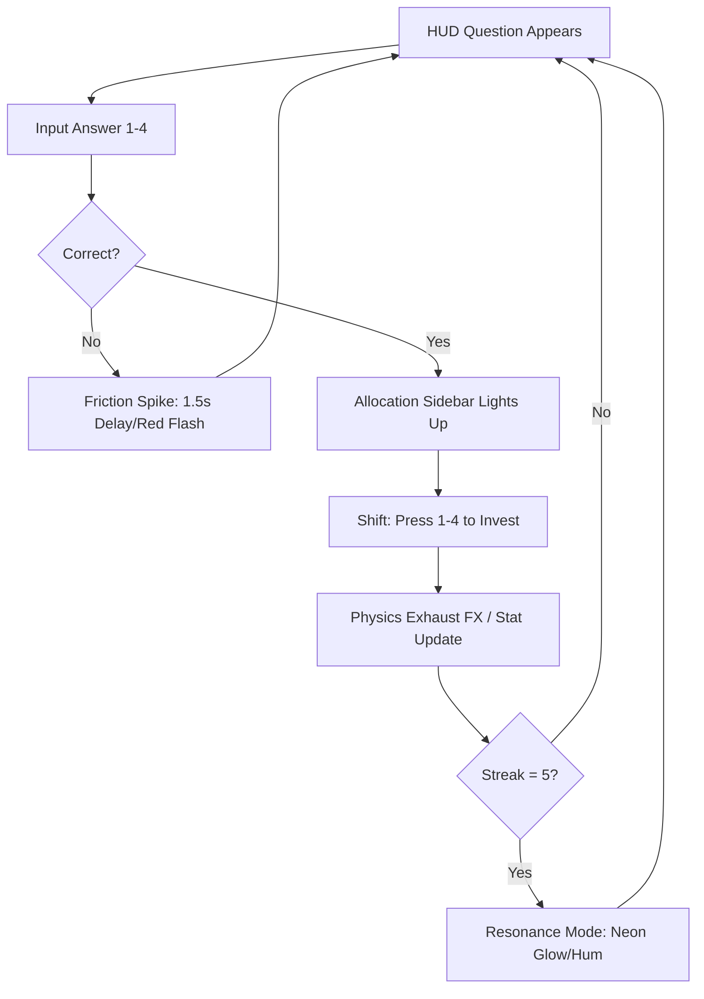
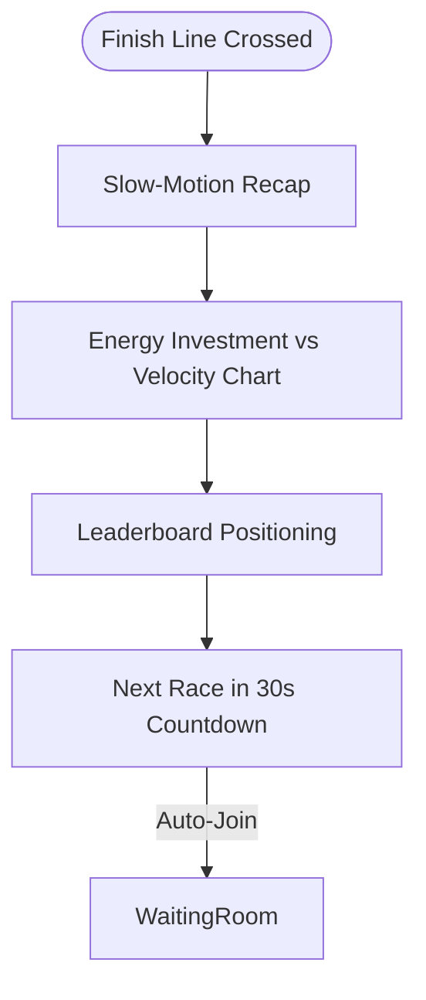

# UX Design Specification mathgame-advanced

**Author:** Minh
**Date:** 2025-12-19T14:35:21+07:00

---

## Executive Summary

### Project Vision
**Calculus Racer** isn't just a math game; it's a **Physics Strategy Engine fueled by mental horsepower.** We are transforming abstract derivatives (Pos/Vel/Acc/Jerk) from dry symbols on a page into visceral momentum. The goal is to move the user from "calculate" to "feel," making the relationship between variables as intuitive as a gear shift in a Ferrari.

### Target Users
*   **Alex (The Competitive Alpha)**: He doesn't want to "study." He wants to win. He needs an interface that feels like a mission-critical dashboard where every millisecond and point allocation counts.
*   **Sarah (The Guide)**: She needs a low-friction entry point to get 30 students "in the zone" quickly, with enough visual "excitement" to keep a classroom engaged.

### Key Design Challenges
*   **The Derivative Bridge**: How do we visually represent the "cascade" (Jerk → Acc → Vel) so it doesn't look like a cluttered spreadsheet?
*   **The Adrenaline Balance**: The "Friction Spike" needs to feel punishing but fair. We need sensory feedback that signals "You're hit!" without breaking the player's concentration.
*   **SpaceX Aesthetics**: Keeping it "minimalist and data-heavy" while remaining readable on a tablet in a noisy classroom.

### Design Opportunities
*   **The Resonance UI**: A chance to use "harmonic visuals" where the screen glows or the sound hums as the player stays "in the zone."
*   **Visceral Allocation**: Using "tactile-feeling" UI controls for Jerk/Acc/Vel allocation to make it feel like "investing" in the future of the race.

## Core User Experience

### Defining Experience
The heartbeat of **Calculus Racer** is the **Tactical Math Loop**:
1.  **Solve**: Rapidly identify the correct derivative answer.
2.  **Invest**: Instantly allocate "Value Points" to Pos/Vel/Acc/Jerk.
3.  **Thrill**: Watch the physics engine respond to your investment in real-time.
*   *Success is measured by the transition from mental calculation to physical momentum.*

### Platform Strategy
*   **Framework**: Single Page Application (SPA) for zero-latency UI updates.
*   **Primary Input**: **Keyboard-First**. 1-2-3-4 keys for answers and allocation to mimic racing controls (gear shifts).
*   **Responsive**: Optimized for Large Tablet (classroom use) and Desktop (home competition).

### Effortless Interactions
*   **Zero-Friction Joining**: Room codes only. No accounts, no emails, just "Enter Code → Race."
*   **Rhythmic Input**: Precise timing between math entry and allocation should feel like a "heartbeat" rhythm.

### Critical Success Moments
*   **The Resonance Trigger**: That moment on the 5th correct answer where the engine sound changes and the UI starts to hum.
*   **The Finish Line Surge**: When a long-term Jerk investment finally cascades into a massive Velocity lead at the final stretch.

### Experience Principles
1.  **Adrenaline Clarity**: High-speed play must not lead to confusion. Vital stats (Position/Win probability) must be readable at a glance.
2.  **Tactical Feedback**: Every correct answer must feel like hitting a turbo pad; every wrong answer must feel like driving into sand (the Friction Spike).
3.  **Data-Visceralism**: Charts and sparklines shouldn't be "boring math"—they should be the "Tachometer" of the car.

## Desired Emotional Response

### Primary Emotional Goals
*   **Calculated Adrenaline**: The feeling of racing against time while maintaining razor-sharp mental focus.
*   **Satisfying Mastery**: That "click" when a complex derivative is solved instantly and your car surges forward.
*   **High-Stakes Focus**: The intense concentration required to avoid the "Friction Spike" penalty.

### Emotional Journey Mapping
*   **Lobby**: Anticipation and low-stakes preparation.
*   **Race (Phase 1)**: Mild pressure. Building the first "Jerk" layers.
*   **The "Hump" (Mid-Race)**: Peak tension. One wrong answer here is devastating.
*   **Resonance (Correct Streak)**: Euphoria. The feeling of being "untouchable" and "in the flow."
*   **Finish Line**: Exhilarating relief or the "One More Game" itch.

### Micro-Emotions
*   **Confidence vs. Panic**: When the timer ticks down, do you trust your math or do you guess? The UX must support **Confidence** through clarity.
*   **Precision vs. Speed**: The internal tug-of-war between answering *now* or answering *perfectly*.

### Design Implications
*   **Mastery → UI Clarity**: If the user feels confused by the UI, they feel "stupid," which kills the fun. We need high-contrast, bold data visualization.
*   **Tension → The Friction Spike**: The UI should visually "shake" or darken slightly when hitting a Friction Spike to emphasize the loss of momentum.
*   **Euphoria → Resonance UX**: Visual harmonics (glowing borders, pulsing bars) to reward the "Resonance" state.

## UX Pattern Analysis & Inspiration

### Inspiring Products Analysis

*   **SpaceX Dragon Dashboard**: 
    *   **The Lesson**: Mission-critical data can be beautiful and minimalist. High-contrast labels, dark mode by default, and clear "state indicators."
    *   **Compelling**: Makes the user feel like an elite operator.
*   **Trackmania (Gaming)**:
    *   **The Lesson**: The "Speed" and "Reset" loops are incredibly fast. The UI stays out of the way of the track, using "speed lines" and FOV shifts to communicate momentum.
    *   **Compelling**: Pure, high-octane focus.
*   **FTL: Faster Than Light (Strategy)**:
    *   **The Lesson**: Strategic power-allocation under fire. You have to choose which system to boost (Shields vs. Engines) while being shot at.
    *   **Compelling**: Meaningful choices in a high-pressure environment.

### Transferable UX Patterns
*   **The "Tachometer" Sparkline**: Borrowed from financial apps or racing sims. We'll use this to show the Pos/Vel/Acc/Jerk trends so the "cascade" is visible.
*   **Keyboard "Shifting"**: Using `1-2-3-4` for allocation (like gear shifts in a racing game) rather than mouse clicks, supporting our "Keyboard-First" principle.
*   **Glowing Harmonic Borders**: Inspired by "Flow State" indicators in rhythm games (like Guitar Hero), to signal our "Resonance" state.

### Anti-Patterns to Avoid
*   **The "Modal" Trap**: Never interrupt the race with a pop-up math question. The question must be a persistent part of the "HUD" so the race flow never breaks.
*   **Data Overload**: Avoid small text or overlapping graphs. If a stat isn't helping you *race*, it shouldn't be on the main screen.

### Design Inspiration Strategy
1.  **Adopt**: The **"SpaceX Minimalist"** visual style (Dark grays, bright neon accents).
2.  **Adapt**: The **"FTL Energy Allocation"** for our Pos/Vel/Acc/Jerk strategy.
3.  **Avoid**: The **"Edtech Playfulness"** (bouncy characters, overly friendly UI). This game is for "Alphas" and "Competitors"—it should feel like a tool, not a toy.

## Design System Foundation

### Design System Choice
**Custom "SpaceX" Design System (Vanilla CSS + HSL)**
We will build a lean, custom design system using Vanilla CSS variables and HSL (Hue, Saturation, Lightness) tokens.

### Rationale for Selection
*   **Visual Uniqueness**: Material Design or Bootstrap will feel too "office tool." We need something that feels like a racing cockpit.
*   **Performance**: Vanilla CSS ensures zero overhead, which is critical for maintaining 30fps+ during physics simulation.
*   **Dynamic Theming**: HSL tokens allow us to easily shift colors for the "Resonance" state (e.g., shifting the background glow from neutral to neon blue).
*   **Keyboard-First Optimization**: We can tailor our component focus states specifically for `1-2-3-4` keyboard navigation.

### Implementation Approach
*   **Utility-First CSS Variables**: Define a core set of `--color-jerk`, `--color-acceleration`, etc.
*   **Mission-Control Typography**: Using a monospaced or high-legibility geometric font (like *Inter* or *JetBrains Mono*) for that technical vibe.
*   **Glassmorphism Components**: Semi-transparent, blurred layers for HUD elements to maintain the "depth" of the race track behind the data.

### Customization Strategy
*   **Color as Data**: Each physics variable (Pos/Vel/Acc/Jerk) will have its own signature color-accent.
*   **Resonance Harmonics**: CSS animations (keyframes) that trigger when streaks are achieved, pulsing the HSL "Saturation" value of the UI.

## 2. Core User Experience

### 2.1 Defining Experience
The defining interaction of **Calculus Racer** is the **"Shift-Momentum"** flow. 
It’s not just answer-and-boost; it’s about the brief, surgical moment where a player decides whether to "Invest in the Future" (Jerk/Acceleration) or "Surge Now" (Velocity). If we nail the transition between these two states, the game becomes addictive.

### 2.2 User Mental Model
*   **The Fighter Pilot**: Players don't see themselves as "students"; they are "operators" in a high-performance cockpit.
*   **The Chain of Command**: Users intuitively understand that Jerk → Acceleration → Velocity. They expect that a Jerk boost will take 2-3 questions to "pay off," while a Velocity boost will be felt instantly.

### 2.3 Success Criteria
*   **Tactile Rhythm**: The `1-2-3-4` key sequence for math entry and allocation must feel as fast as a combo in a fighting game.
*   **Visceral Feedback**: A "Jerk" investment should make the car's engine sound "deeper," while "Velocity" should make it sound "higher."
*   **Clarity under Pressure**: The player should never have to look away from the car to see the math question.

### 2.4 Novel UX Patterns
*   **The HUD Overlay**: Instead of a "sidebar" for math, the question and answers are projected as a semi-transparent HUD *around* the player's car. The race and the math occupy the same visual space.
*   **Cumulative Sparklines**: A real-time graph showing the 4 variables stacked on top of each other, visualizing how one derivative "pours" into the next.

### 2.5 Experience Mechanics
1.  **Initiation**: Question fades into the **HUD Overlay** as soon as the previous allocation is complete.
2.  **Interaction**: 
    - **Step A**: Input numerical answer or selection via `1-4`.
    - **Step B**: HUD transforms into 4 allocation "Pipes" (Pos/Vel/Acc/Jerk).
    - **Step C**: Player "Shifts" (presses `1-4`) to allocate value.
3.  **Feedback**: 
    - **Success**: Car emits color-coded "Physics Exhaust" (e.g., Purple for Jerk).
    - **Failure**: "Friction Spike" – Car frame turns red, "Drag" particles appear, and the HUD flickers/shuts down for 1.5 seconds.
4.  **Completion**: Cross the Finish Line → Slow-motion transition into a **"Race Analytics"** dashboard.

## Visual Design Foundation

### Color System
*   **Base (Dark Matter)**: `hsl(230, 15%, 7%)` — Deep, technical background.
*   **Neutral (Steel)**: `hsl(230, 10%, 40%)` — Secondary text and HUD borders.
*   **Logic Accents (The HSL Core)**:
    *   **Position**: `hsl(200, 100%, 50%)` (Neon Blue)
    *   **Velocity**: `hsl(150, 100%, 45%)` (Emerald Green)
    *   **Acceleration**: `hsl(45, 100%, 50%)` (Cyber Yellow)
    *   **Jerk**: `hsl(280, 100%, 65%)` (Electric Purple)
*   **Semantic States**:
    *   **Success/Resonance**: `hsl(160, 100%, 40%)`
    *   **Friction Spike/Error**: `hsl(0, 100%, 50%)`

### Typography System
*   **Primary Typeface**: **JetBrains Mono** (Monospaced) — Used for mission-critical data, numbers, and HUD labels.
*   **Secondary Typeface**: **Inter** (Geometric Sans) — Used for descriptions, room settings, and general UI controls.
*   **Scale**: Large, bold data displays focused on peripheral legibility during high-speed racing.

### Spacing & Layout Foundation
*   **Structural Unit**: 8px base grid for component spacing.
*   **Density**: High-density cockpit layout. Elements are grouped tightly into functional "clusters" (Stats, Question, Tactics).
*   **HUD Philosophy**: Non-modal, semi-transparent layers that overlay the race track to maintain immersion.
*   **Glassmorphism**: HUD panels use `backdrop-filter: blur(12px)` and subtle borders to differentiate data from the environment.

### Accessibility Considerations
*   **WCAG Contrast**: All HSL logic accents are validated for AA compliance against the Dark Matter background.
*   **Keyboard Focus**: High-visibility neon borders for focused inputs (`1-4` keys).
*   **ARIA Integration**: Real-time accessible labels for all physics-cascading events.

## Design Direction Decision

### Design Directions Explored
We explored two primary visual paths: **Direction A (Minimalist HUD)** which focused on immersive, floating UI elements, and **Direction B (Tactical Dashboard)** which emphasized a mission-control style with dense telemetry.

### Chosen Direction
**Direction B: Tactical Dashboard**
The user opted for the "Operator" experience, prioritizing real-time data visualization and a strategic sidebar over a minimalist HUD.

### Design Rationale
*   **Strategy Focus**: Represents the "Derivative Cascade" (Jerk → Acc → Vel) as distinct, measurable telemetry bars.
*   **Mission Control Vibe**: Aligns with the "Alex (Competitive Alpha)" persona who wants to feel like an elite operator.
*   **Clear Hierarchy**: Separates the "Physics Simulation" (right) from the "Tactical Strategy" (left sidebar).

### Implementation Approach
*   **The Sidebar**: A persistent CSS Grid/Flexbox container on the left for all physics variables.
*   **HUD Question**: A high-visibility overlay positioned near the top of the race view to minimize eye travel.
*   **Glassmorphism**: Dense, dark blurs for the sidebar to ensure text legibility over the high-speed background.

## User Journey Flows

### 1. The "Zero-Friction" Lobby Flow
Get a student from "Bored in class" to "Racing" in under 10 seconds.

### 2. The "Calculus Combat" Racing Flow
Maintain peak flow state during 3 minutes of high-intensity math.

### 3. The "Post-Mission" Analysis Flow
Reinforce the learning of the derivative relationship.

### Flow Optimization Principles
*   **Minimizing Eye Travel**: The HUD overlay ensures the user rarely looks away from the car.
*   **Reducing Friction**: No email/login required; callsigns are temporary.
*   **Error Recovery**: The "Rebooting" flicker provides clear visual feedback for errors without a frustrating modal pop-up.

## Component Strategy

### Design System Components
We match our **Custom Vanilla CSS Foundation** for:
*   **Typography Tokens**: `mission-mono` (Headings) and `inter-ui` (Interface).
*   **Color Tokens**: HSL variables for the physics variables.
*   **Grid System**: A fixed dashboard layout with a 1:3 sidebar ratio.

### Custom Components

#### 1. Telemetry Sidebar Stack
*   **Purpose**: Visualize the "Derivative Cascade" in real-time.
*   **Usage**: Fixed to the left edge of the screen.
*   **Anatomy**: 4 vertical bars (Jerk, Acc, Vel, Pos) with integrated sparklines.
*   **States**: 
    - **Idle**: Muted colors.
    - **Accumulating**: Glowing transition when a variable is receiving points.
    - **Resonance**: Dynamic pulsation of the bar height.

#### 2. HUD Question Overlay
*   **Purpose**: Present math challenges precisely where the player is looking.
*   **Interactions**: Inputs `1-4` for answers.
*   **Feedback**: 
    - **Correct**: HUD borders turn emerald green briefly.
    - **Error**: HUD flickers red (The Reboot Effect).

#### 3. Physics Exhaust (FX Component)
*   **Purpose**: Visual reward for allocation.
*   **Visuals**: Particles emitting from the car in the 4 signature variable colors.
*   **Behavior**: Speed/Intensity proportional to the value of the boost.

#### 4. Resonance Aura (Interaction Wrapper)
*   **Purpose**: Reward the Flow State.
*   **Behavior**: A CSS-based vignette/glow that appears on the 5th correct answer, pulsing in time with the game music/rhythm.

### Component Implementation Strategy
*   **Modular CSS**: Each component will have its own `.css` file or scoped block (e.g., `sidebar.css`, `hud.css`).
*   **State-Targeted Classes**: Using data-attributes (e.g., `data-resonance="active"`) to trigger HSL-based transitions.
*   **Performance**: Zero heavy JS frameworks. All visual state changes will be handled via class toggles and CSS Transitions.

### Implementation Roadmap
*   **Phase 1**: Telemetry Sidebar & HUD Question (The "Playable" UI).
*   **Phase 2**: Resonance Aura & Physics Exhaust (The "Visceral" Juice).
*   **Phase 3**: Post-Race Analytics Component (The "Reflection" Data).

## UX Consistency Patterns

### 1. Mission Control (Button Hierarchy)
*   **Primary Action**: Large, glowing neon borders. Used only for "Join Race" or "Launch." 
*   **Tactical Action**: Text-only or subtle borders. Used for `1-4` allocation choices.
*   **Secondary Action**: Muted gray borders. Used for Lobby settings or Volume.

### 2. Physics Feedback (Success & Error)
*   **The "Resonance" Streak (Success)**: 
    - **Visual**: HSL hue shift to Emerald Green; border glow pulses at 120bpm.
    - **Audio**: A subtle harmonic hum added to the engine sound.
*   **The "Reboot" Effect (Error)**: 
    - **Visual**: Screen flickers red; HUD elements "shut down" (black out) for 1.5s; "LOW SIGNAL" text appears.
    - **Physical**: CSS "Shake" animation applied to the car container.

### 3. Tactical Form Patterns (Lobby)
*   **No Labels**: Use large, placeholder-as-label styling for the Room Code and Callsign.
*   **Auto-Focus**: As soon as the lobby loads, the "Room Code" input is focused and ready for typing.

### 4. Transition Patterns (The Pre-Race Boot)
*   **Pattern**: When the race starts, the HUD doesn't just "appear"—it **boots up**. Elements slide from the edges and the telemetry bars "fill" from zero to initial values over 0.8s. This frames the player's mindset as an "Operator."

## Responsive Design & Accessibility

### Responsive Strategy
*   **Desktop First**: This is our primary environment. The "Tactical Dashboard" layout thrives on 1080p+ screens with physical keyboards for the `1-4` shifting.
*   **Tablet Strategy (Secondary)**: 
    *   **Landscape Only**: The physics engine and dashboard require horizontal real estate. 
    *   **Touch-to-Shift**: On tablets, the `1-4` keyboard shortcuts will be replaced by large, "Thumb-sized" touch zones in the sidebar.
*   **Mobile (Restricted)**: We will implement a "Spectator Only" mode for mobile devices. The math-racing experience is too dense for small screens.

### Breakpoint Strategy
*   **Mission Critical (>1024px)**: Full Tactical Dashboard + High-Fid Physics.
*   **Tactical Tablet (768px - 1023px)**: Consolidated sidebar; simplified background physics to maintain 60fps.
*   **Mobile (<767px)**: Simplified HUD showing leaderboard blips and "Launch Desktop to Play" message.

### Accessibility Strategy
*   **WCAG 2.1 AA Compliance**:
    - **Contrast**: All HSL tokens for physics variables are high-contrast (Neon on Dark Matter).
    - **Focus Management**: The HUD question always holds the primary "Focus" state; a clear glowing border indicates the active variable being "invested" in.
*   **Screen Reader "Telemetry"**: We will provide an "Aural HUD" option that reads out correct answers and significant velocity changes via ARIA Live regions.
*   **Tactile Feedback**: For devices that support it, we'll use small vibration pulses (Haptics) for the "Resonance" state and "Friction Spike."

### Testing Strategy
*   **The "Classroom Scan"**: Testing on various Chromebooks and iPads to ensure performance on lower-tier hardware.
*   **Focus-Tab Loop**: Verifying we can play the entire game without a mouse.

### Implementation Guidelines
*   **Relative Units**: Use `rem` and `vh/vw` for the HUD to ensure it "fits" the cockpit on different screen sizes.
*   **Haptic API**: Integrate the Web Vibrate API for the Friction Spike penalty.
*   **ARIA Live**: Use `polite` regions for constant telemetry updates to avoid overwhelming screen reader users.
